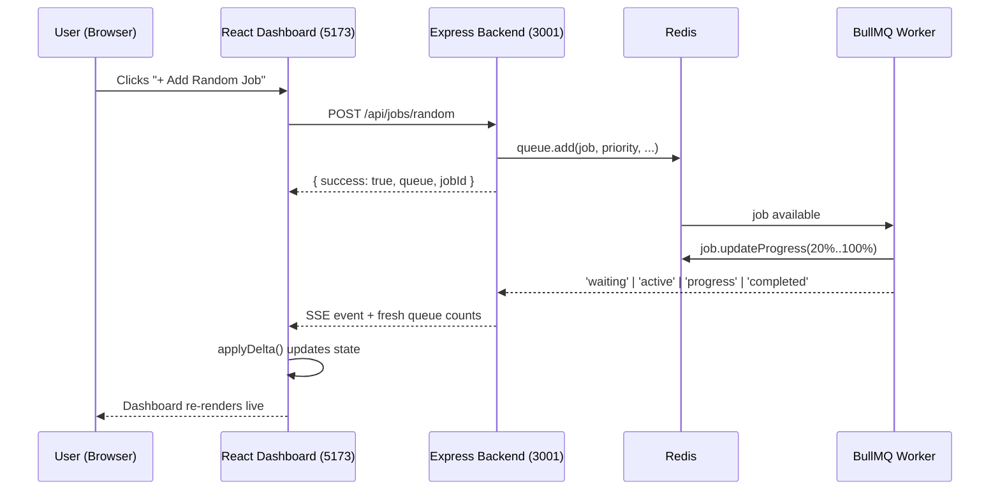
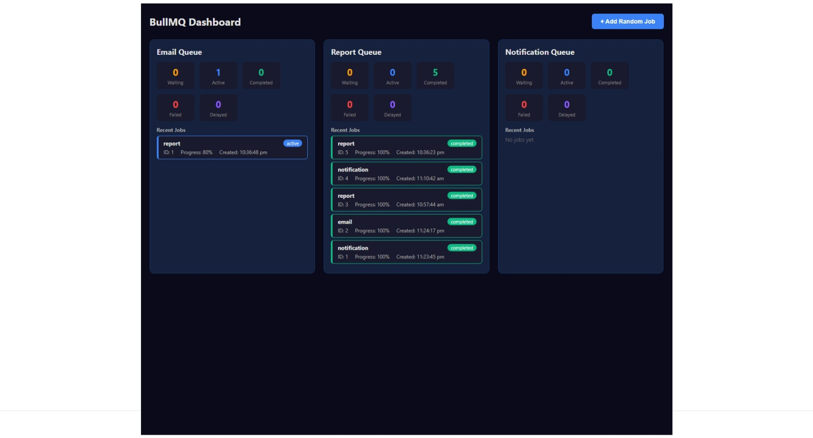
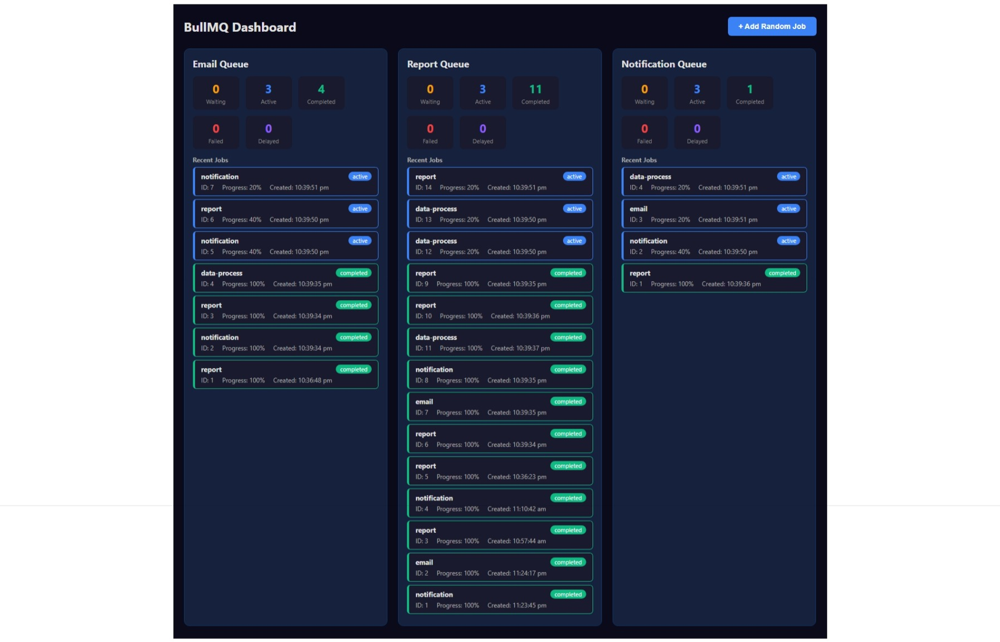

# BullMQ Learning Dashboard

A full-stack **job queue management dashboard** built to demonstrate how [BullMQ](https://docs.bullmq.io/) (a Redis-based job queue library for Node.js) works in a real application.

The app simulates a small company that processes three kinds of background work — **email sending**, **report generation**, and **notifications**. Users can create jobs from a web dashboard, watch them being picked up by workers, and follow their progress live — from *waiting* all the way to *completed* or *failed*.

> **What is BullMQ?**
> BullMQ is a popular Node.js library for managing background jobs. Jobs are stored in **Redis** and processed by **workers**. Producers add jobs to a queue; workers pull jobs from the queue, process them, and update their status. It is used for things like sending emails, generating reports, resizing images, and any other slow work that should not block the main application.

---

## Table of Contents

- [About the Project](#about-the-project)
- [Tech Stack & Technologies Used](#tech-stack--technologies-used)
- [Project Structure](#project-structure)
- [Architecture Overview](#architecture-overview)
- [Backend](#backend)
  - [Overview](#backend-overview)
  - [Prerequisites](#backend-prerequisites)
  - [Project Files Explained](#backend-project-files)
  - [Installation & Running](#backend-installation--running)
  - [API Endpoints](#api-endpoints)
- [Frontend](#frontend)
  - [Overview](#frontend-overview)
  - [Prerequisites](#frontend-prerequisites)
  - [Project Files Explained](#frontend-project-files)
  - [Installation & Running](#frontend-installation--running)
- [How It Works — Step by Step](#how-it-works--step-by-step)
- [UI Screenshots](#ui-screenshots)
- [Run Everything with Docker](#run-everything-with-docker)
- [Environment Variables](#environment-variables)
- [Troubleshooting](#troubleshooting)

---

## About the Project

This project is a hands-on learning application for **job queues**. Instead of just reading about BullMQ, you can:

1. Add jobs to a queue from a button click (random jobs) or through an API (custom jobs).
2. Watch **workers** process jobs automatically, one step at a time.
3. See live status updates on the dashboard: **Waiting → Active → Completed / Failed**, including a **progress bar**.
4. Inspect each queue's counts and the recent 20 jobs per queue.

The project is split into two parts:

| Part     | What it does                                                                                              |
| -------- | --------------------------------------------------------------------------------------------------------- |
| Backend  | Express + TypeScript server. Defines queues, adds jobs (producer), processes jobs (workers), and streams live updates to clients over SSE. |
| Frontend | React + TypeScript + Vite single-page dashboard. Shows queue status in real time and lets you create jobs. |
| Redis    | The message store and backbone of BullMQ. Holds all queues and jobs.                                      |

There are **three queues**, each with its own dedicated worker:

- **email** — e.g. sending welcome or promotional emails
- **report** — e.g. generating CSV/PDF reports
- **notification** — e.g. pushing a push notification to a user

### Key Features

- **3 independent queues** managed with BullMQ
- **Live real-time updates** using Server-Sent Events (SSE)
- **Job progress tracking** (0 → 100%) simulated by workers
- **Priority support** — each random job gets a random priority
- **Job history** — the last 50 completed and 50 failed jobs are kept per queue
- **Dark-themed dashboard UI** showing per-queue counts and recent jobs

---

## Tech Stack & Technologies Used

| Technology    | Purpose                                                                                  |
| ------------- | ----------------------------------------------------------------------------------------- |
| **Node.js**   | JavaScript runtime that runs both the backend and the build tooling.                      |
| **TypeScript**| Typed superset of JavaScript used across the entire project (backend + frontend).         |
| **Express**   | Minimal web framework for the backend REST API and the SSE endpoint.                      |
| **BullMQ**    | The core job queue library. Provides `Queue` (producer) and `Worker` (consumer).          |
| **ioredis**   | Redis client used by BullMQ to talk to Redis.                                             |
| **Redis**     | In-memory data store that holds all queues, jobs, and their status.                       |
| **Server-Sent Events (SSE)** | Push channel that streams job events from the backend to the browser in real time. |
| **React**     | UI library used to build the dashboard.                                                   |
| **Vite**      | Modern dev server and build tool for the frontend.                                        |
| **uuid**      | Generates unique job IDs.                                                                |
| **cors**      | Lets the browser call the backend during development.                                     |
| **tsx**       | Runs TypeScript directly during development (no build step needed).                       |
| **Docker**    | Optional — spins up Redis (and optionally the backend) in containers.                     |

---

## Project Structure

```
bullmq-app/
├── README.md                     ← You are here
├── .gitignore
├── docs/
│   └── screenshots/              ← UI screenshots referenced in this document
├── backend/                      ← Express + BullMQ server
│   ├── package.json
│   ├── tsconfig.json
│   ├── Dockerfile
│   ├── docker-compose.yml        ← Redis + backend services
│   └── src/
│       ├── index.ts              ← Express server, REST + SSE routes
│       ├── redis.ts              ← Redis connection config
│       ├── queues.ts             ← Queue definitions (email, report, notification)
│       ├── producer.ts           ← Add jobs + read queue status
│       ├── workers.ts            ← Worker definitions (process jobs)
│       ├── sse.ts                ← SSE client management + event broadcasting
│       └── types.ts              ← Shared TypeScript types
└── frontend/                     ← React dashboard
    ├── package.json
    ├── tsconfig.json
    ├── vite.config.ts            ← Dev server + /api proxy to backend
    ├── index.html
    └── src/
        ├── main.tsx              ← App entry point
        ├── App.tsx               ← Root layout
        ├── api/
        │   └── bull.ts           ← API client + SSE connection
        └── components/
            ├── QueueDashboard.tsx← Main dashboard (queue cards + add job button)
            └── JobCard.tsx       ← Single job row with status badge & progress
```

---

## Architecture Overview

```
┌─────────────────────────────┐
│      Browser (React)        │
│   BullMQ Dashboard (:5173)  │
└──────────────┬──────────────┘
               │  fetch  /api/...         (REST: create jobs, read status)
               │  EventSource /api/events (SSE: live updates)
               ▼
┌─────────────────────────────┐            ┌─────────────────────────────┐
│   Express Backend (:3001)   │            │          Redis              │
│  ┌────────────┐             │  reads/    │   ┌─────────────────────┐   │
│  │ producer.ts│─────────────┼───────────▶│   │ email queue         │   │
│  │ queues.ts  │  writes jobs│            │   │ report queue        │   │
│  └────────────┘             │            │   │ notification queue   │   │
│  ┌────────────┐             │            │   └─────────────────────┘   │
│  │ workers.ts │◀────────────┼─────────── │   (jobs, status, progress)  │
│  │ 3 Workers  │  pick up    │            └─────────────────────────────┘
│  └────────────┘             │
│  ┌────────────┐             │
│  │   sse.ts   │ broadcasts  │
│  └────────────┘             │
└─────────────────────────────┘
```

**The three roles in BullMQ:**

- **Producer** — code that adds jobs to a queue (`queue.add(...)`). Here, that is `producer.ts`.
- **Queue** — the named list of pending work stored in Redis. Defined in `queues.ts`.
- **Worker** — code that takes jobs out of the queue and processes them. Defined in `workers.ts`.

---

## Backend

### Backend Overview

The backend is an **Express + TypeScript** application that:

- Exposes a **REST API** to add jobs and read queue status.
- Defines the three BullMQ **queues** and three **workers** that process jobs.
- Simulates job work (each job takes ~5 seconds, in 5 steps of 20% progress each).
- Streams **real-time events** (waiting, active, progress, completed, failed) to all connected dashboards via **SSE**.

It runs on **port 3001** by default and requires a running **Redis** instance on **port 6379**.

### Backend Prerequisites

To run or understand the backend, you should have:

1. **Node.js** (v18 or newer is recommended — the Docker image uses Node 22) and **npm** installed.
2. A running **Redis** server (v6 or newer is recommended).
   - Either via Docker (`docker compose up -d redis`), or
   - A locally installed Redis (e.g. `redis-server` on Linux/macOS, or WSL/Memurai on Windows).
3. **Redis CLI** (optional but helpful) to inspect what BullMQ stores.
4. Basic understanding of these concepts:
   - **TypeScript** and **ES modules** (the code uses `import`/`export`).
   - **Express** routes and middleware (`express.json()`, `cors()`).
   - **BullMQ core ideas**: `Queue`, `Worker`, `Job`, job lifecycle states.
   - **Promises/async-await** — nearly every BullMQ call is asynchronous.

### Backend Project Files

| File                  | What it does                                                                                                                              |
| --------------------- | ------------------------------------------------------------------------------------------------------------------------------------------ |
| `src/index.ts`        | Entry point. Creates the Express app, registers CORS + JSON middleware, defines all REST routes, serves the SSE endpoint, and starts the server. Calls `setupSSEListeners()` on startup. |
| `src/redis.ts`        | Reads the `REDIS_URL` environment variable and converts it into the connection object that BullMQ uses (`maxRetriesPerRequest: null` is required by BullMQ). |
| `src/queues.ts`       | Creates the three `Queue` instances (`email`, `report`, `notification`) sharing one Redis connection, plus a `queueMap` so routes can look up a queue by name. |
| `src/producer.ts`     | **Producer side.** `addRandomJob()` adds a random job to a random queue. `addJobToQueue()` adds a custom job to a named queue. Also `getQueueStatus()` / `getAllQueueStatuses()` read counts + recent jobs. |
| `src/workers.ts`      | **Consumer side.** Creates one `Worker` per queue (concurrency 3). Each job is processed in 5 steps of 1 second, updating progress each step. Logs job completion/failure to the console. |
| `src/sse.ts`          | Manages connected SSE clients and broadcasts events. On new connection it sends an `initial` snapshot. Listens to BullMQ events (`waiting`, `active`, `completed`, `failed`, `progress`) and pushes them to all browsers. |
| `src/types.ts`        | Shared interfaces: `JobPayload` (what a job carries) and `JobStatus` (a job's lifecycle state).                                          |

### Backend Installation & Running

```bash
# 1. Go into the backend folder
cd backend

# 2. Install dependencies
npm install
```

**Start Redis (pick one option):**

```bash
# Option A — Redis via Docker (recommended)
docker compose up -d redis

# Option B — Redis already installed locally
redis-server
```

**Run the backend in development mode (auto-restarts on file changes):**

```bash
npm run dev
```

You should see:

```
Backend running on http://localhost:3001
```

Verify it is healthy:

```bash
# Open in browser or curl:
curl http://localhost:3001/api/health
```

Expected response:

```json
{ "status": "ok", "workers": 3 }
```

**Build & run in production mode:**

```bash
npm run build     # compiles TypeScript to ./dist
npm start         # runs node dist/index.js
```

| Script             | Command                                     |
| ------------------ | ------------------------------------------- |
| `npm run dev`      | Start dev server with hot reload (`tsx watch`) |
| `npm run build`    | Compile TypeScript to `dist/`               |
| `npm start`        | Run the compiled production build           |

### API Endpoints

| Method | Endpoint              | Description                                                                                 |
| ------ | --------------------- | ------------------------------------------------------------------------------------------- |
| POST   | `/api/jobs/random`    | Adds a **random job** (random type, priority, data) to a **random queue**.                   |
| POST   | `/api/jobs`           | Adds a job to a specific queue. Body: `{ "queue": "email", "data": { ... } }`.               |
| GET    | `/api/queues`         | Returns status for **all** queues, including their recent 20 jobs.                           |
| GET    | `/api/queues/:name`   | Returns counts for one queue, e.g. `/api/queues/email`.                                      |
| GET    | `/api/events`         | SSE stream. Pushes `initial`, `waiting`, `active`, `progress`, `completed`, `failed` events. |
| GET    | `/api/health`         | Health check. Returns `{ status: "ok", workers: 3 }`.                                       |

---

## Frontend

### Frontend Overview

The frontend is a **React + TypeScript** single-page app built with **Vite**. It shows a dark-themed dashboard with one card per queue. Each card displays:

- The queue name.
- Five live counters: **Waiting**, **Active**, **Completed**, **Failed**, **Delayed**.
- The **20 most recent jobs**, each as a small card with a colored status badge and progress percentage.

It connects to the backend via **SSE**, so the whole dashboard updates in real time whenever a job is created, starts, progresses, completes, or fails.

### Frontend Prerequisites

To run or understand the frontend, you should have:

1. **Node.js** and **npm** installed.
2. Basic understanding of:
   - **React** (function components, `useState`, `useEffect`).
   - **TypeScript** interfaces and imports.
   - **Vite** dev server basics.
   - **Fetch API** and **Server-Sent Events** (`EventSource`).

No API keys or environment variables are needed for the frontend — during development, Vite **proxies** every `/api` request to the backend at `http://localhost:3001` (configured in `vite.config.ts`). This avoids CORS issues.

### Frontend Project Files

| File                                  | What it does                                                                                                                          |
| ------------------------------------- | ------------------------------------------------------------------------------------------------------------------------------------- |
| `index.html`                          | HTML entry point. Loads `/src/main.tsx` and renders into `<div id="root">`.                                                           |
| `vite.config.ts`                      | Vite configuration: dev server on **port 5173** and a proxy so `/api/*` calls hit the backend on port 3001.                            |
| `tsconfig.json`                       | TypeScript configuration for the React app.                                                                                            |
| `src/main.tsx`                        | Entry point. Mounts the root `<App />` component into the DOM.                                                                        |
| `src/App.tsx`                         | Root layout. Renders the `<QueueDashboard />` inside a centered container with the app's dark background.                             |
| `src/api/bull.ts`                     | **API client.** All `fetch` wrappers (`addRandomJob`, `addJob`, `getAllQueues`, ...) plus `connectQueueEvents()` which opens the SSE stream and maps each event type to a typed object. |
| `src/components/QueueDashboard.tsx`   | Main dashboard. Opens the SSE connection, applies live updates to state (`applyDelta`), renders the header with the **+ Add Random Job** button, and one queue card per queue. |
| `src/components/JobCard.tsx`          | Renders a single job row: name, status badge, ID, progress %, creation time, and any failure reason. Status drives the border/badge color. |

### Frontend Installation & Running

```bash
# 1. Go into the frontend folder
cd frontend

# 2. Install dependencies
npm install

# 3. Start the dev server
npm run dev
```

Then open **http://localhost:5173** in your browser.

> **Make sure the backend is running too** — otherwise the dashboard will show "No data available. Is the backend running?"

**Build for production:**

```bash
npm run build     # type-checks with tsc then bundles with vite
npm run preview   # serve the production build locally
```

| Script            | Command                                              |
| ----------------- | ---------------------------------------------------- |
| `npm run dev`     | Start Vite dev server on `http://localhost:5173`     |
| `npm run build`   | Type-check and build a production bundle             |
| `npm run preview` | Preview the production build locally                 |

---

## How It Works — Step by Step

Here is exactly what happens, from page load to a completed job:

### 1. The dashboard loads

1. You open `http://localhost:5173`.
2. React mounts `<QueueDashboard />`.
3. On mount, `useEffect` calls `connectQueueEvents(...)` which opens an `EventSource` connection to **`/api/events`** (proxied to the backend).
4. The backend registers your browser as an SSE client and immediately sends an **`initial`** event containing the current snapshot of all queues (counts + recent jobs).
5. The dashboard shows one card per queue with live counts.

### 2. You create a job

6. You click the **"+ Add Random Job"** button.
7. The frontend calls `POST /api/jobs/random` (via `addRandomJob()`).
8. The backend's `addRandomJob()` in `producer.ts`:
   - Picks a random queue name from `email`, `report`, `notification`.
   - Builds a payload with a **UUID** id, a random job **type**, random **data**, and a random **priority** (0–9).
   - Calls `queue.add(type, payload, { priority, removeOnComplete: {count: 50}, removeOnFail: {count: 50} })`.
9. BullMQ writes the job into **Redis** for that queue. The queue keeps only the last 50 completed and 50 failed jobs.
10. The API responds `{ success: true, queue, jobId }`.

### 3. The worker picks it up

11. The dedicated worker for that queue (created in `workers.ts`, running since startup) sees a new job in the queue.
12. The worker marks the job **active** and starts processing it:
    - Runs 5 simulated steps, each waiting **1 second**, and calls `job.updateProgress(20%)`, `40%`, ... `100%`.

### 4. Live updates stream to the dashboard

13. Every BullMQ event triggers a handler registered in `setupSSEListeners()`:
    - `waiting` → job added to queue
    - `active` → worker started the job
    - `progress` → job progress changed
    - `completed` / `failed` → job finished
14. For each event, the backend fetches the fresh queue **counts** and the **job data**, then `broadcast()`s an SSE message to every connected browser.
15. On the frontend, `connectQueueEvents` receives the message, and `applyDelta` updates the React state:
    - counters are replaced with the new counts,
    - the job is moved to the top of the recent-jobs list (if the event is waiting/active/completed/failed),
    - the progress percentage is updated live (for `progress` events).
16. Because React re-renders on state change, you see the numbers and job cards change **in real time without refreshing the page**.

### 5. The job finishes

17. After ~5 seconds the worker logs `Completed job <id>` and returns `{ processed: true, queue, jobId }`.
18. The backend broadcasts a `completed` event, the dashboard bumps the Completed counter, and the job card turns green.

If a job ever throws an error, the worker emits a `failed` event, the backend logs the error, and the dashboard shows the job in red with the `failedReason`.



---

## UI Screenshots

### Dashboard Overview

The main screen — three queue cards, each with live counters and recent jobs.



### Live Job Progress

Active jobs show a progress bar and percentage that update in real time over SSE.



---

## Run Everything with Docker

The easiest way to start **Redis + the backend** together:

```bash
cd backend
docker compose up --build
```

This starts:

- **Redis** (`redis:7-alpine`) on port **6379** with a named volume so data survives restarts.
- The **backend** (`node:22-alpine`, development target) on port **3001**, with `REDIS_URL=redis://redis:6379`, source files mounted for hot reload.

The **frontend still runs locally** with Vite:

```bash
cd frontend
npm install
npm run dev
```

Open **http://localhost:5173**.

To stop Docker services: `docker compose down`. To also remove the data volume: `docker compose down -v`.

---

## Environment Variables

| Variable      | Used by  | Default                   | Description                                    |
| ------------- | -------- | ------------------------- | ---------------------------------------------- |
| `REDIS_URL`   | Backend  | `redis://localhost:6379`  | Full Redis connection string parsed by `redis.ts`. Supports username/password/db. |
| `PORT`        | Backend  | `3001`                    | Port the Express server listens on.            |

The frontend has **no environment variables** — the Vite dev proxy handles all API routing.

---

## Troubleshooting

| Problem                                   | Likely cause                        | Fix                                                                     |
| ----------------------------------------- | ----------------------------------- | ----------------------------------------------------------------------- |
| Dashboard says "No data available. Is the backend running?" | Backend not running or Redis down. | Start Redis, then `npm run dev` in `backend/`. Check `http://localhost:3001/api/health`. |
| `ECONNREFUSED` in backend logs            | Redis is not running.               | `docker compose up -d redis` (or start your local Redis on port 6379).   |
| Queue "email" not found (400/500 error)   | Wrong queue name sent to `/api/jobs`. | Use one of: `email`, `report`, `notification`.                          |
| Browser console shows SSE connection errors | Backend not reachable.              | Confirm backend is on port 3001 and the Vite proxy target matches.       |
| Jobs never complete                       | Workers not running.                | The workers start with the backend — check the backend console for `[queue] Completed job ...` logs. |

---

## Summary

- **Backend** (`backend/`) = Express + TypeScript + BullMQ + Redis, with REST routes, 3 workers, and SSE live streaming.
- **Frontend** (`frontend/`) = React + TypeScript + Vite dashboard showing queues, counts, jobs, and live progress.
- **Redis** holds everything; **BullMQ** orchestrates producers → queues → workers; **SSE** pushes updates to the browser.

Happy queueing!
